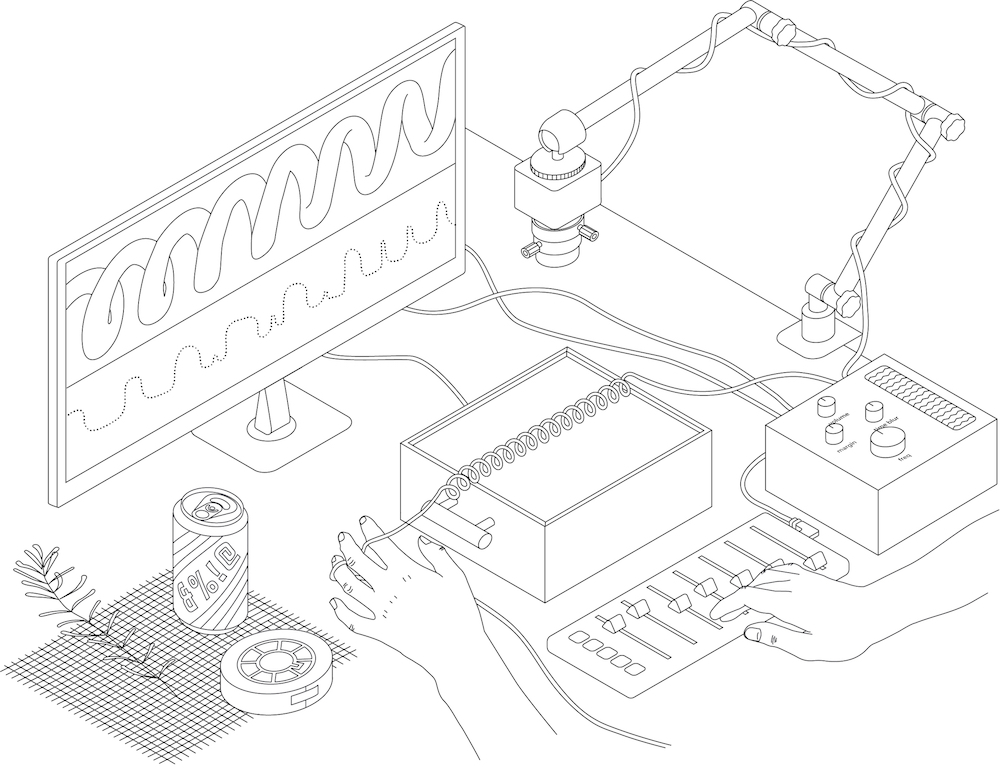

Pattern Organ 

A Pure Data patch for a camera based optical synthesiser. 

## Instrument Description

The Pattern Organ is a PD patch intended to run on a Raspberry Pi 5. 

The patch takes a 1-500 pixel variable horizontal slice from the middle of a live camera feed. To construct a wavetable, the mean average pixel luminance across the height (y dimension) of the slice is computed for each x pixel, resulting in a one dimensional array that refreshes at the camera's frame rate. 
This dynamic array is normalised to a float in the range -1.0 to 1.0, and written into a wavetable, to be scanned at a controllable speed. 
The GEM window, intended as a full screen graphic display when playing the instrument, shows a black and white slice of the camera feed, a visual graphic of the one dimensional array, and a visualisation showing the shape of the shifting wavetable.  
In this version, 7 oscillators are tuned to various different tuned relationships, all falling within ranging between 20 and 200Hz (low frequencies to allow for complexities and higher perceptual pitches from fluctuations of light and dark in the image matrix)

Controls + Parameters

Midi Controller:
8 x faders, amplitude control for 7 separate oscillators, and main output
7 x pots, fine grained detuning of separate oscillators
5 x buttons, tuning switches to select different frequency relationships between the 7 oscillators. 

Analogue input from Arduino / Rasp Pi. You might want to shift these parameter controls to the midi controller.

blur - smears pixel data in time, creating a decay across multiple frames
margin - controls the pixel height of the adjustable margin taken from image matrix

The instrument has a time blur parameter, that smears information in time, smoothing transitions between frames. For this composition and performance, the wavetable was continually read by 7 oscillators, . A midi controller is used to switch between different oscillator tunings and control the volume of each oscillator with separate faders. 
## Instruction + Equipment

For best use, use with a Raspberry Pi 5. 
Use with a manual lens camera, such as the ELP USB 4K camera
Recommended midi controller is the Korg nanoKONTROL2
## License

GPLv3 — free to use, modify, and share, as long as it's open-source.

## Author

Jasmine Butt. 
An outcome of UWE funded research.

## Acknowledgements

Huge thanks to Matt Olden for the help and support with GEM and PD on a pi. 
https://matthewolden.co.uk/?cat=6

